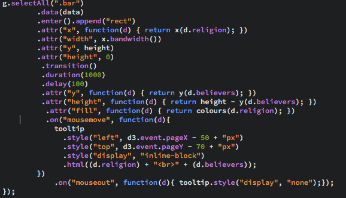

# project_1
Course Information Design First Project


## My Data

The data I used is called Correlates of War: World Religions (World, regional, and national populations by religious beliefs) [Link to dataset](https://www.kaggle.com/umichigan/world-religions/data)

Excerpt from their Data Description: 

The World Religion Project aims to provide detailed information about religious adherence worldwide since 1945. It contains data about the number of adherents by religion in each of the states in the international system for every half-decade period. Some of the religions are divided into religious families, and the breakdown of adherents within a given religion into religious families is provided to the extent data are available.
The project was developed in three stages. The first stage consisted of the formation of a religions tree. A religion tree is a systematic classification of major religions and of religious families within those major religions. To develop the religion tree we prepared a comprehensive literature review, the aim of which was to define a religion, to find tangible indicators of a given religion of religious families within a major religion, and to identify existing efforts at classifying world religions. The second stage consisted of the identification of major data sources of religious adherence and the collection of data from these sources according to the religion tree classification. This created a dataset that included multiple records for some states for a given point in time, yet contained multiple missing data for specific states, specific time periods, and specific religions. The third stage consisted of cleaning the data, reconciling discrepancies of information from different sources, and imputing data for the missing cases.

### Acknowledgements
The dataset was created by Zeev Maoz, University of California-Davis, and Errol Henderson, Pennsylvania State University, and published by the Correlates of War Project.

# Bar Chart

### My Goal

To show the most popular religions around the globe I chose to use a Bar Chart, simply because this chart is very straightforward and will give you an immediate answer. In this case “What religion is the most popular around the world?”

## Getting Started

First thing’s first, find a skeleton to work off of. 

I used the Simple Bar Chart in V4 by Mike Bostock [Link to Bar Chart](https://bl.ocks.org/mbostock/3885304) for the base.
I copied and pasted his code, and separated HTML from CSS and Javascript. 


Now that I had a working skeleton, I had to add my own data. Using Excel I deleted rows of data that I didn’t need, and was left with the data that was relevant. I only used the rows which said for instance ‘Christianity_all’  instead of adding all the subgroups of christianity. The two dates that I kept the data for are 1950 and 2010. 


Now I put that data in a CSV format and added it to my files. To load in this CSV file I had to change the name of the dataset that was being loaded in. 


Now I had to change all the instances where the code returned the wrong value from the dataset that was contained in the example. So d.salesperson changed to d.religon, and d.sales to d.believers. This way the chart would be returning values from my own data.


I’ve changed the margins and width of my chart to make it a bit more organised. Now it looks like this:


After seeing how small and uninteresting some values are, like zoroastrianism, baha'i and taoism (They are way too small compared to the other religions) I’ve decided to add these values onto ‘Other religions’. After this change the chart became way more neat and understandable


## The Tooltip

I wanted to add a little bit of interaction in the form of a Tooltip. I’ve used one before, but it doesn’t work in V4 of D3.js. When I try to add it I get the error “d3-tip is not a function”. I really wanted a tooltip, because it gives the user some extra insight into how much believers there are, because I don’t have a super detailed y-axis. So I went looking on the internet for a tooltip that could be used in V4. After looking around I found this person: [Link to Tooltip](https://github.com/VACLab/d3-tip) It seemed like he had the same troubles as me


He claimed to have made a tooltip that can be used with V4 and without ES6. In his words: “The version of d3-tip in this repository is D3js v4 compatible. At the same time, it does not require ES6 support from your browser. This is accomplished with two basic changes.

```
	1.	d3.functor is defined. This was defined in version 3 of D3, but disappeared in version 4. It gets redefined in this version of d3-tip.
	2.	d3.tip is defined. This mimics the prior behavior of d3-tip, allowing you to use tooltips as documented in the original repository [Link](https://github.com/Caged/d3-tip).
```

After reading this I tried to use his tooltip in my own code. I went and took a look in his .js file: [Link](https://github.com/VACLab/d3-tip/blob/master/d3-tip.js) I noticed that it looked really complicated and I was lost reading it.


I decided to move on to find another tooltip. I stumbled upon this: [Link to tooltip](https://bl.ocks.org/alandunning/274bf248fd0f362d64674920e85c1eb7) This person used the same bar chart as a building block, so this should be easy! 

I started adding all the tooltip codes to my own, changing the values to those that matched my data, and soon found some errors. The first one was that ‘Colours are not defined’ I found that they added a fill to the bar svg. So I deleted that line of code. After that, I didn’t get any errors, but my bar chart had turned black, ignoring my css… The tooltip was working though! (The only thing about that was I forgot to delete the pound symbol from the example). 


The example had made a variable of the colors of the bars using a range. so I guess I had to do the same. I didn’t mind, as color didn’t play a big part of my chart. So I re-added the fill attribute and added the colour variables, and everything was fine again. 


I was going to worry about the colors and styling later. On to the transition!
The Transition
For the transition I used this example: [Link to Transition](https://bl.ocks.org/jamesleesaunders/f32a8817f7724b17b7f1), All I had to do was add a transition with a delay, and make sure that the height that the animation will go to matches the y axis and my data. I also had to make sure all the attributes were in the right order.
```
.transition()
        .duration(1000)
        .delay(100)
        .attr("y", function(d) { return y(d.believers); })
        .attr("height", function(d) { return height - y(d.believers); })
```
	
### Uh-oh
After Adding the transition, my tooltip stopped working and i recieved the error "Error: unknown type: mousemove" in my console log. 
I started looking at my code and rearranging the attributes in my bar svg. But nothing worked. I went to google for help. It turned out someone had the same problem as me. [Link](https://stackoverflow.com/questions/22645162/d3-when-i-add-a-transition-my-mouseover-stops-working-why)

Apparently, using the .selectAll on the bar chart as a variable, and splitting the transition from the tooltip mouse events should work. So I tried it. It dit take care of the error, but my tooltip still wasn’t showing up. 

 to 


After some digging around I found out that the problem was in my .css file. I had forgotten to close the declaration above the tooltip property, and my tooltip started working again. 


I was able to style the tooltip with basic css, since the tooltip is linked to class.

# Line Chart

### My Goal

The goal is to show the time evolution of religions globally in 65 years, from 1945 to 2010.
I’m going to use a Line Graph, because I find this graph to be perfect for showing time-based data. I can also use multiple lines in this graph, with that I can display the timeline of multiple religions at the same time.

## Getting Started

First I had to find a skeleton to work off of.

My search was pretty specific: Line Graph with Tooltip v4. Because of this I immediatly found a great starting block: [Link to Line Graph](http://bl.ocks.org/wdickerson/64535aff478e8a9fd9d9facccfef8929) I especially like the fact that the tooltip shows the date, and the values of all the different would-be religions. 


The only problem I saw with the JS is that this person used const’s and let. I didn’t know what these things were when I first saw them so I decided to do some research on it. The whole code in general seemed a bit intimidating, but I could make sense out of some of it. 

Turns out, I can just replace const with var and everything will still work, great! [Link](https://developer.mozilla.org/nl/docs/Web/JavaScript/Reference/Statements/const)

I copied and pasted the code from the example, and separated the HTML from the script. Then I started adding my own data. 
Now I was running into some problems. When I changed the data in json, the lines started disappearing. I started getting the error: “TypeError: chart.selectAll(...).data(...).enter is not a function”. Leading me to believe something might be telling the script that there can only be 3 lines in total. 

After taking a good look at my .json file, and with the help of my classmate, I noticed I hadn’t closed off the fourth line properly. So I fixed that. I had forgotten to add a ] at the end.

Now that I had all my data I had to edit the range of the graph, so that the values match the maximum and all the lines are better visible


The y axis said 2G and I’ve fixed that by adding d3.axisLeft(y).tickFormat(d3.format(',.0f')); I’ve changed the tickformat: (',.0f’) using this, the y axis shows the accurate numbers with comma’s to make it more readable.
After doing this my Line Graph was showing my data.

### Tooltip

Now I noticed that the tooltip only shows every 10 year interval, and skips the 5 year. I went searching in my code and found this:
```
function drawTooltip() {
  var year = Math.floor((x.invert(d3.mouse(tipBox.node())[0]) + 0) / 10) * 10;
```
After changing the math to + 0) / 5) * 5;, the tooltip seemed to work! Now it’s time to style my tooltip.

I’ve changed the height of the SVG so that the tooltip will underneath the Graph, for beter visability. I also added a border instead of a background color. I’ve changed the font & added a column for readability.


### Navigation

Now it’s time to add some navigation between the two graphs i’ve made. I’ve decided to just add simple HTML and CSS to the headers of both graphs. Making buttons that will lead to each graph. I’ve also started styling everything.


I’ve added a button underneath my bar chart that links to assignment B, which is an animation of a fantasy graph.


Here's what my graphs looked like after I styld them:


# Assignment B
The goal of this assignment is to make a fantasy chart that you probably can’t code yourself (yet!)
For my fantasy chart i’ve chosen to stay in the same headspace as the two charts I have already made. So something to do with religion.

### Trying to come up with something interesting...
So since I was basing my fantasy graph on the same data, I had to start brainstorming about what might be an interesting insight. My coach had told me about the huge shifts in religion Indonesia has had, and I started creating ideas for graphs around that. 

- - - - 

The only problem was, I couldn't really think of a good insight that would result from this, and how it might fit in with my other graphs. It felt kind of weird to suddenly zoom in on a country. After doing some research I found out that the shift in religion for Indonesia started in the 1400's so that would also mean going further back in time. 

I decided I should retire Indonesia and go back to looking at religion from a global viewing point. Then I got an idea of how to show WHERE the believers were, instead of just how many there were. I came up with an idea for a graph that would turn words, in this case names of countries, into a religious symbol. The size of the words would implicate the number of believers.

--- 

After showing it to my coach he said that this wouldn't really give a big insight in the data, and I agreed. Even though I liked the idea, it was a little bit tame seeing as I could even make up data for this fantasy graph. He suggested to maybe think of people who switch religions and how I could visualise that.

I thought it was a good idea and already ideas started pouring into my head. The idea of data pouring out of that boring old Bar Chart to showcase a dataset that would be extremely hard to get by if it was real: How many people went from one religion, to another? 

### My Graph
Since the data I’ve used for my first two charts is quite extensive, I’ve decided to use the same dataset for my fantasy chart, or at least the base of my chart. I wanted to make a fantasy chart using fantasy data. In this case the chart I have made for assignment B shows us how many people changed their religion in the past 65 years (from 1945 - 2010), in this case, I’ve chosen to show you an example of what that fantasy graph would look like. Using animation!  


The graph starts with the Bar Chart I made that shows the current most populair religions. If you were to click on a bar, in this case the first bar that stands for Christianity (as shown in my Bar Chart), something interesting will happen. The bar will start leaking value. It seems as if the bar itself is losing some data. 


The data is caught by a type of bowl, which will then weigh the liquid data that has just poured out of our bar chart, and gives us the number of people who have changed their beliefs from being a christian. 


Now a button appears that asks the question on everyone’s mind “What happened?” Well the animation shows that after the button is clicked, this liquid data starts leaking out and pouring into new bars that are slowly filling up to their respective values. 


You can now see where the percentage of the christians that lost their faith went to. 


And this process would be exactly the same (but in a different color and with a different outcome) If you had clicked on a different bar in the Bar Chart.
